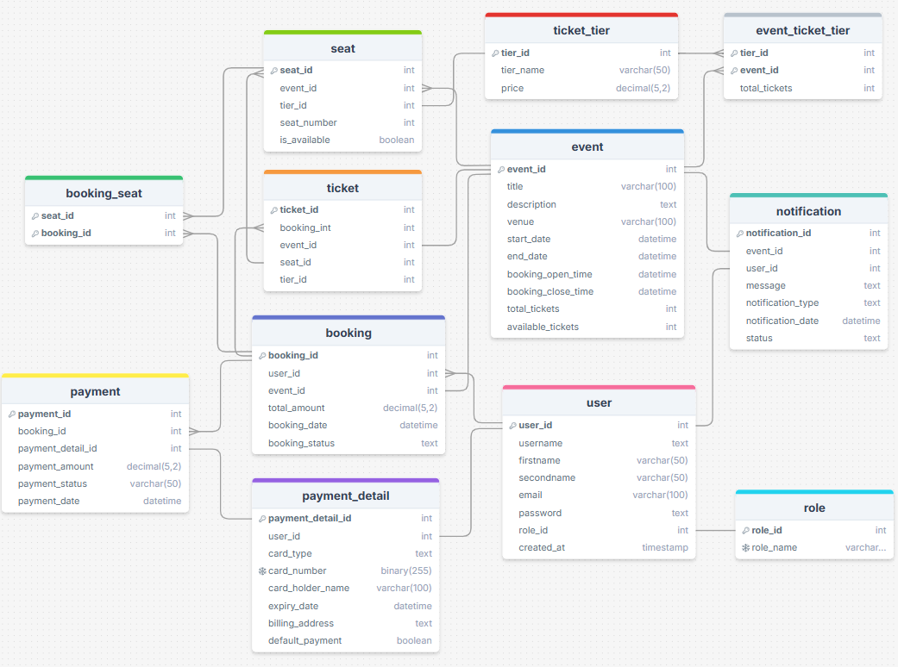

# 🎟️ Event Ticket Booking System

### 📝 Overview
An Event Ticket Booking System that allows users to browse, search, and book tickets for a variety of entertainment events such as concerts, sports games, movies, or theater shows. The system includes features for event management, ticket availability tracking, seat selection, and payment processing.

### 🌟 Key Features
- 🔒 **User Authentication**: Secure user registration, login, and profile management.
- 🔍 **Event Browsing & Search**: Browse events by category and search based on date, venue, or price.
- 🪑 **Seat Selection**: Interactive seat selection for reserved seating.
- 🎫 **Ticket Booking**: Simplified ticket booking with integrated payment.
- 🛠️ **Admin Dashboard**: Create/manage events, view analytics, and handle cancellations or refunds.
- 📧 **Notifications**: Automated email notifications for booking confirmations, cancellations, and promotions.
- 💰 **Dynamic Pricing**: Different ticket tiers with variable pricing.
- 💳 **Payment Processing**: Secure payments with the option to save payment details.

### 🛠️ Technology Stack


---

## 🗃️ Database Design
Below is the ER diagram for the Event Ticket Booking System:



| Table Name        | Description                                                                                     |
|-------------------|-------------------------------------------------------------------------------------------------|
| role              | Stores user roles with unique role IDs and role names.                                          |
| user              | Holds user information including names, emails, passwords, and associated roles.                |
| event             | Contains details of events including title, venue, dates, and ticket availability.              |
| booking           | Represents user bookings for events, including total amount and status.                         |
| ticket_tier       | Defines different ticket tiers and their prices.                                                |
| event_ticket_tier | Links events to ticket tiers, specifying total tickets per tier.                                |
| seat              | Lists seats for events, indicating tier, availability, and unique seat numbers.                 |
| booking_seat      | Maps seats to bookings to track reserved seats for each booking.                                |
| ticket            | Represents tickets issued for bookings, including event, seat, and tier information.            |
| notification      | Stores notifications sent to users related to events, including status and type.                |
| payment_detail    | Contains payment details for users, such as card type and billing information.                  |
| payment           | Tracks payments for bookings, including amount, status, and associated payment details.         |

---

## 🚀 Installation & Setup
### Prerequisites
- 🐋 **Docker** installed and running
- 🐍 **Python 3.9+** and pip (for local development)
- 🗃️ **MySQL server** setup (local or cloud-based)

## 💻 Local Development

1. **Clone the repository:**
   ```bash
   git clone https://github.com/rsmythrepo/Event_ticket_booking_system.git
   cd Event_ticket_booking_system
   ```

2. **Install dependencies:**
   ```bash
   pip install -r requirements.txt
   ```

3. **Set up environment variables:**
   ```bash
   setx ENCRYPTION_KEY "crypto-key"
   ```

4. **Run the application:**
   ```bash
   python run.py
   ```

5. **Access the app:**
   Open [http://localhost:5000](http://localhost:5000) in your web browser.

---

## 🐳 Local Docker Deployment

1. **Build and run the containers:**
   ```bash
   docker-compose up --build
   ```

2. **Access the app:**
   Visit [http://localhost:5000](http://localhost:5000).

---

## ☁️ EC2 Docker Deployment

1. **Connect to Your EC2 Instance:**
   ```bash
   ssh -i /path/to/your-key.pem ec2-user@your-ec2-public-ip
   ```

2. **Update the system packages:**
   ```bash
   sudo yum update -y
   ```

3. **Install Docker:**
   ```bash
   sudo yum install -y docker
   sudo service docker start
   sudo systemctl enable docker
   ```

4. **Install Docker Compose:**
   ```bash
   sudo curl -L "https://github.com/docker/compose/releases/download/$(curl -s https://api.github.com/repos/docker/compose/releases/latest | grep -Po '"tag_name": "\K[0-9.]+')" /docker-compose-$(uname -s)-$(uname -m)" -o /usr/local/bin/docker-compose
   sudo chmod +x /usr/local/bin/docker-compose
   ```

5. **Build and run the containers:**
   ```bash
   sudo docker-compose up --build -d
   ```

6. **Show running containers:**
   ```bash
   sudo docker ps
   ```

7. **Configure Security Group:**
   Create an inbound rule under the EC2 security groups:
   - **Type**: Custom TCP
   - **Protocol**: TCP
   - **Port Range**: 5000
   - **Source**: Anywhere (0.0.0.0/0)

8. **Access the app from EC2:**
   Open [http://<EC2_PUBLIC_IP>:5000](http://<EC2_PUBLIC_IP>:5000) in your web browser.

---

## 🤝 Contributors
<table>
  <tr>
    <td align="center">
      <a href="https://github.com/rsmythrepo">
        <br />
        <sub><b>Raphaelle Smyth</b></sub>
    </td>
    <td align="center">
      <a href="https://github.com/AskhatBissembay">
        <br />
        <sub><b>Askhat Bissembay</b></sub>
    </td>
    <td align="center">
      <a href="https://github.com/Vikiyuk">
        <br />
        <sub><b>Yurii Maisuradze</b></sub>
    </td>
  </tr>
</table>


  


